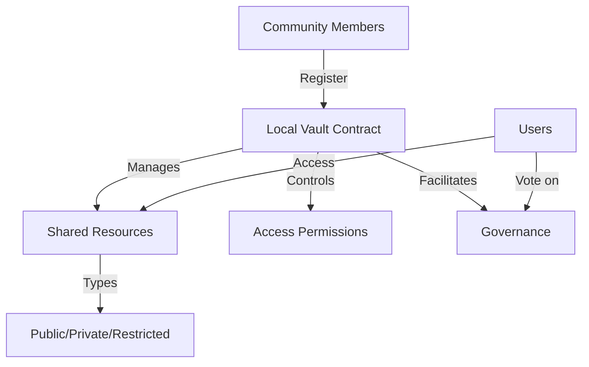

# Local Utility: Community Resource Management

A decentralized platform for managing shared resources, enabling secure access control, governance, and collaborative management.

## Overview

Local Utility provides a blockchain-powered solution for communities to:
- Manage shared resources transparently
- Control access with granular permissions
- Create and vote on community proposals
- Track resource utilization and contributions

The platform empowers communities by providing a trustless, decentralized infrastructure for resource management.

## Architecture

The system is built around a core smart contract that manages:



### Core Components:
- Member Registry
- Resource Management
- Access Control System
- Governance Mechanism

## Contract Documentation

### local-vault.clar

The main contract handling core functionality of the Local Utility platform.

#### Key Features:
- Member registration and verification
- Resource registration and metadata storage
- Flexible access control (Public, Private, Restricted)
- Governance proposal system

#### Access Types:
- `ACCESS-TYPE-PUBLIC` (u1): Freely accessible resources
- `ACCESS-TYPE-PRIVATE` (u2): Limited access resources
- `ACCESS-TYPE-RESTRICTED` (u3): Requires explicit permission

## Getting Started

### Prerequisites
- Clarinet
- Stacks wallet for deployment/interaction

### Basic Usage

1. Create a proposal:
```clarity
(contract-call? .local-vault create-proposal 
    "Community Center Upgrade"
    "Proposal to renovate and expand community center facilities"
    u1000
)
```

2. Grant resource access:
```clarity
(contract-call? .local-vault grant-resource-access 
    "community-center-001" 
    member-principal
)
```

## Function Reference

### Public Functions

#### Member Management
- `get-member`: Retrieve member information

#### Resource Management
- `verify-resource`: Verify a resource (admin function)
- `grant-resource-access`: Grant access to restricted resources
- `get-resource`: Retrieve resource information

#### Governance
- `create-proposal`: Create a community proposal
- `finalize-proposal`: Conclude voting on a proposal

## Development

### Testing
1. Clone the repository
2. Install Clarinet
3. Run tests:
```bash
clarinet test
```

### Local Development
1. Start Clarinet console:
```bash
clarinet console
```
2. Deploy contracts:
```clarity
(contract-call? .local-vault ...)
```

## Security Considerations

### Access Control
- Granular resource access management
- Explicit permission requirements
- Admin-controlled verification process

### Governance
- Transparent proposal creation and voting
- Fixed voting periods
- Immutable proposal tracking

### Limitations
- On-chain storage limited to metadata
- Actual resource details should be referenced externally
- Governance limited to registered members

## Contributing

Contributions are welcome! Please read our contribution guidelines and code of conduct.

## License

[Specify your license here]